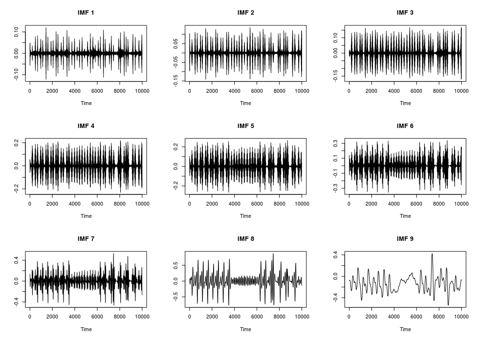
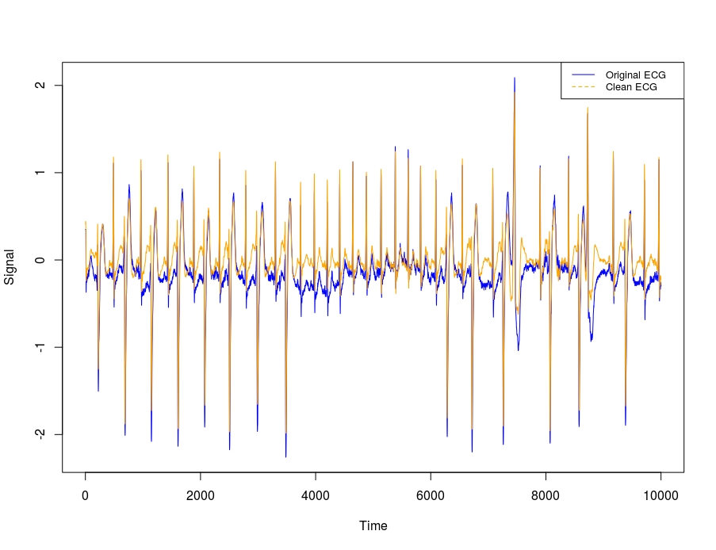
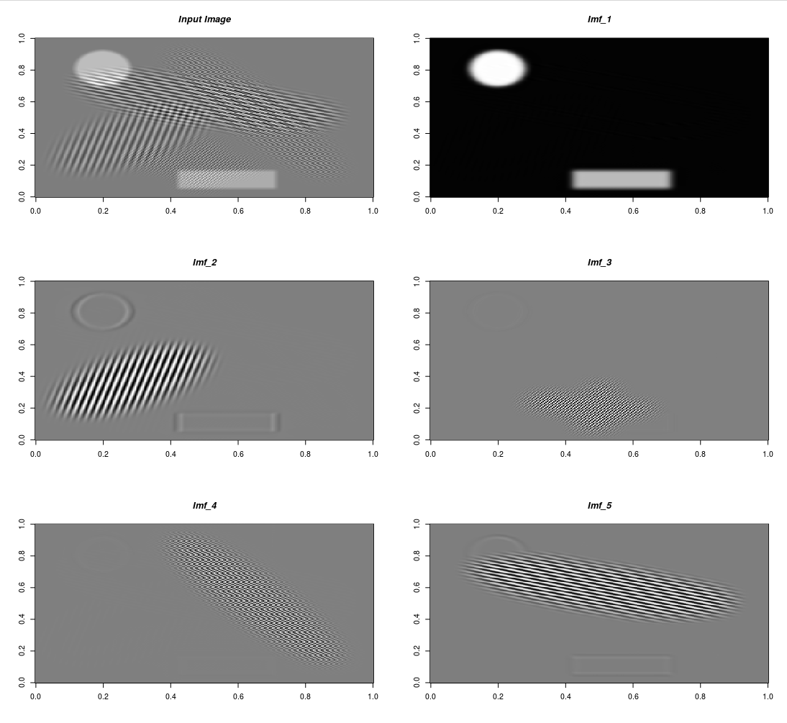

```{r, include = FALSE}
knitr::opts_chunk$set(
  collapse = TRUE,
  comment = "#>",
  eval = FALSE,
  echo = TRUE)
```


The **VMDecomp** R package is an *RcppArmadillo* implementation of the Matlab Code for *Variational Mode Decomposition* (1- and 2-dimensional) based on the papers,

* "Variational Mode Decomposition" by K. Dragomiretskiy and D. Zosso in IEEE Transactions on Signal Processing, vol. 62, no. 3, pp. 531-544, Feb.1, 2014, https://doi.org/10.1109/TSP.2013.2288675
* "Two-Dimensional Variational Mode Decomposition" by Dragomiretskiy, K., Zosso, D. (2015), In: Tai, XC., Bae, E., Chan, T.F., Lysaker, M. (eds) Energy Minimization Methods in Computer Vision and Pattern Recognition. EMMCVPR 2015. Lecture Notes in Computer Science, vol 8932. Springer, https://dx.doi.org/10.1007/978-3-319-14612-6_15

The Matlab code is available to download in the Author's website (https://math.montana.edu/dzosso/code/).

## Example Use Cases

VMD has been used in many scientific areas with true or synthetic data. I'll explain the functionality of the *VMDecomp* R package using two simple use cases.

### Noise Removal (1-Dimensional VMD)

In the Authors' paper "Variational Mode Decomposition" (page 13 / 16) is mentioned, *"A  'clean'  electrocardiogram (ECG)  signal  can  be  reconstructed  by  summing  all but  the  first  and last  VMD  modes,  thus  discarding the low-frequency baseline oscillation and most of the high-frequency noise."* I'll use the *'arrhythmia'* data (especially the first column which corresponds to the *modified limb lead II (MLII)*) for this purpose. This same example appears also online ([Matlab Mathworks](https://www.mathworks.com/help/wavelet/ref/vmd.html)).

```{r}

require(VMDecomp)
require(glue)

data(arrhythmia)

alpha = 2000       # moderate bandwidth constraint
tau = 0            # noise-tolerance (no strict fidelity enforcement)
K = 9              # 9 modes
DC = FALSE         # no DC part imposed
init = 1           # initialize omegas uniformly
tol = 1e-6

vec_arrhythmia = arrhythmia[['MLII']]

set.seed(1)
arr_vmd = vmd(data = vec_arrhythmia, 
              alpha = alpha,
              tau = tau, 
              K = K, 
              DC = DC,
              init = init, 
              tol = tol,
              verbose = TRUE)

# 1-dimensional VMD starts ...
# --------------------------------
# The 1-dimensional VMD starts ...
# --------------------------------
# Iteration: 10   uDiff: 2.28024
# Iteration: 20   uDiff: 1.05777
# Iteration: 30   uDiff: 0.515047
# Iteration: 40   uDiff: 0.346114
# Iteration: 50   uDiff: 0.277273
# Iteration: 60   uDiff: 0.240478
# Iteration: 70   uDiff: 0.212126
# Iteration: 80   uDiff: 0.20821
# Iteration: 90   uDiff: 0.196179
# ...............
# Iteration: 470   uDiff: 0.00728391
# Iteration: 480   uDiff: 0.00698528
# Iteration: 490   uDiff: 0.00663912
# Iteration: 500   uDiff: 0.00629761
# -----------------------------------------
# The algorithm converged in iteration: 500
# -----------------------------------------
# Elapsed time: 0 hours and 0 minutes and 19 seconds. 


str(arr_vmd)
# List of 3
#  $ u    : num [1:10000, 1:9] -0.0695 -0.0697 -0.0702 -0.0707 -0.0711 ...
#  $ u_hat: cplx [1:10000, 1:9] 6.54e-04+0.0i -3.83e-03+5.1e-04i -1.99e-03+8.5e-04i ...
#  $ omega: num [1:500, 1:9] 0 0.00561 0.00595 0.00596 0.00586 ...


op <- par(mfrow = c(3, K/3))

for (item in K:1) {
  item_mode = glue::glue("IMF {K-item+1}")
  plot(x = arr_vmd$u[, item], type = 'l', main = item_mode, xlab = 'Time', ylab = '')
}

```



<br>

The previous plot shows the intrinsic mode functions (IMF's). Based on the Authors' statement if we exclude the first and last Modes (IMF's) we'll receive a noise-free ECG,

```{r}

imfs_noise_free = rowSums(arr_vmd$u[, -c(1,K)])

op <- par(mfrow = c(1,1))

plot(x = vec_arrhythmia, type = 'l', col = "blue", xlab = 'Time', ylab = 'Signal')
lines(x = imfs_noise_free, col = "orange")
legend("topright", 
       legend = c("Original ECG", "Clean ECG"),
       col = c("blue", "orange"), 
       lty = 1:2, 
       cex = 0.8)

```



### Synthetic image segmentation (2-Dimensional VMD)

To explain the functionality of the *"vmd()"* R function for 2-dimensional data I'll load the synthetic image used in section 3.1 of the Authors' second paper where it's mentioned,

*"The synthetic image is a composition of spatially overlapping basic shapes, more precisely six ellipses and a rectangle, with frequency patterns varying in both periodicity and direction... The spectrum is ideal for segmentation due to modes being deliberately both well isolated and narrow-banded. The resolution of the synthetic image is 256 x 256 and the experiment was run with parameters Alpha = 1000 and K = 5. This experiment converged in 520 iterations which took 45 seconds on a standard PC. The algorithm has no problems in accuracy nor timeliness in segmenting the image into its five constituent sub-images. The first is the DC component of the image - a solid ellipse and rectangle, while the four remaining decompositions show clear separation of the patterned ellipses. Due to the solid pieces having sharp edges, their spectra are not band limited, and only smoothed versions are recovered."*

```{r}

require(R.matlab)
require(OpenImageR)

pth_texture = system.file('Matlab', 'VMD_2D', 'texture.mat', package = 'VMDecomp')
data = R.matlab::readMat(pth_texture)
data = data$f
dim(data)
# [1] 256 256

alpha = 1000       # bandwidth constraint
tau = 0.25         # Lagrangian multipliers dual ascent time step
K = 5              # number of modes
DC = TRUE          # includes DC part (first mode at DC)
init = 1           # initialize omegas randomly, may need multiple runs!
tol = 1e-7         # tolerance (for convergence)

set.seed(2)
res_2d = vmd(data = data,
             alpha = alpha,
             tau = tau,
             K = K,
             DC = DC,
             init = init,
             tol = tol,
             verbose = TRUE)

# --------------------------------
# The 2-dimensional VMD starts ...
# --------------------------------
# Iteration: 10  uDiff: 42.7451  omegaDiff: 0.00012395
# Iteration: 20  uDiff: 1.05264  omegaDiff: 1.15039e-09
# Iteration: 30  uDiff: 0.31892  omegaDiff: 4.14469e-10
# Iteration: 40  uDiff: 0.117648  omegaDiff: 1.45234e-10
# Iteration: 50  uDiff: 0.0491776  omegaDiff: 6.399e-11
# Iteration: 60  uDiff: 0.0222704  omegaDiff: 3.33701e-11
# Iteration: 70  uDiff: 0.0106591  omegaDiff: 1.87647e-11
# Iteration: 80  uDiff: 0.0053165  omegaDiff: 1.08343e-11
# Iteration: 90  uDiff: 0.00273909  omegaDiff: 6.30121e-12
# ............
# Iteration: 250  uDiff: 6.31694e-07  omegaDiff: 1.22605e-15
# Iteration: 260  uDiff: 4.33964e-07  omegaDiff: 8.05652e-16
# Iteration: 270  uDiff: 3.08055e-07  omegaDiff: 5.66624e-16
# Iteration: 280  uDiff: 2.26559e-07  omegaDiff: 4.31241e-16
# Iteration: 290  uDiff: 1.728e-07  omegaDiff: 3.54727e-16
# Iteration: 300  uDiff: 1.36554e-07  omegaDiff: 3.11406e-16
# Iteration: 310  uDiff: 1.11508e-07  omegaDiff: 2.86634e-16
# -----------------------------------------
# The algorithm converged in iteration: 317
# -----------------------------------------
# Elapsed time: 0 hours and 0 minutes and 41 seconds.

end_dims = dim(res_2d$u)[3]
str(res_2d)
# List of 3
#  $ u    : num [1:256, 1:256, 1:5] 3.16e-05 1.80e-05 -3.32e-06 -3.17e-05 -6.32e-05 ...
#  $ u_hat: cplx [1:256, 1:256, 1:5] 7.65e-04+0.00i -6.63e-04-3.28e-04i 7.74e-04-3.15e-04i ...
#  $ omega: num [1:317, 1:2, 1:5] 0 0 0 0 0 0 0 0 0 0 ...

```

<br>

To the output IMF's I'll also include the input image and then I'll visualize all images in a multi-plot to verify that each IMF represents a different shape of the input image,

```{r}

res_2d_lst = lapply(1:end_dims, function(x) res_2d$u[,, x])
res_2d_lst = append(res_2d_lst, list(data), after = 0)
str(res_2d_lst)
# List of 6
#  $ : num [1:256, 1:256] 0 0 0 0 0 0 0 0 0 0 ...
#  $ : num [1:256, 1:256] 3.16e-05 1.80e-05 -3.32e-06 -3.17e-05 -6.32e-05 ...
#  $ : num [1:256, 1:256] -4.36e-05 -3.08e-05 -1.19e-05 2.28e-05 6.01e-05 ...
#  $ : num [1:256, 1:256] -2.67e-07 2.53e-06 1.03e-06 1.94e-06 2.44e-07 ...
#  $ : num [1:256, 1:256] 3.31e-06 1.21e-06 2.15e-06 1.66e-07 4.97e-07 ...
#  $ : num [1:256, 1:256] 6.72e-06 9.27e-06 1.14e-05 8.79e-06 1.45e-06 ...


init_plt = OpenImageR::GaborFeatureExtract$new()
mlt_plt = init_plt$plot_multi_images(list_images = res_2d_lst, 
                                     par_ROWS = 3, 
                                     par_COLS = 2, 
                                     axes = TRUE,
                                     titles = c("Input Image", glue::glue("Imf_{1:end_dims}")))

```



